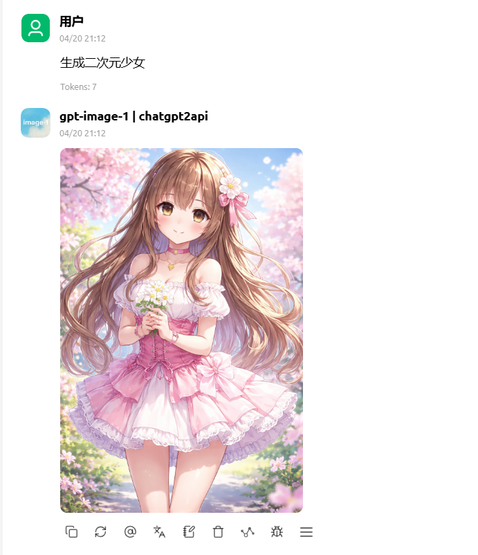

<h1 align="center">ChatGPT2API</h1>


<p align="center">ChatGPT2API 主要是对 ChatGPT 官网相关能力进行逆向整理与封装，提供面向 ChatGPT 图片生成、图片编辑、多图组图编辑场景的 OpenAI 兼容图片 API / 代理，并集成在线画图、号池管理、多种账号导入方式与 Docker 自托管部署能力。</p>

> [!WARNING]
> 免责声明：
>
> 本项目涉及对 ChatGPT 官网文本生成、图片生成与图片编辑等相关接口的逆向研究，仅供个人学习、技术研究与非商业性技术交流使用。
>
> - 严禁将本项目用于任何商业用途、盈利性使用、批量操作、自动化滥用或规模化调用。
> - 严禁将本项目用于破坏市场秩序、恶意竞争、套利倒卖、二次售卖相关服务，以及任何违反 OpenAI 服务条款或当地法律法规的行为。
> - 严禁将本项目用于生成、传播或协助生成违法、暴力、色情、未成年人相关内容，或用于诈骗、欺诈、骚扰等非法或不当用途。
> - 使用者应自行承担全部风险，包括但不限于账号被限制、临时封禁或永久封禁以及因违规使用等所导致的法律责任。
> - 使用本项目即视为你已充分理解并同意本免责声明全部内容；如因滥用、违规或违法使用造成任何后果，均由使用者自行承担。

> [!IMPORTANT]
> 本项目基于对 ChatGPT 官网相关能力的逆向研究实现，存在账号受限、临时封禁或永久封禁的风险。请勿使用你自己的重要账号、常用账号或高价值账号进行测试。

## 快速开始

已发布镜像支持 `linux/amd64` 与 `linux/arm64`，在 x86 服务器和 Apple Silicon / ARM Linux 设备上都会自动拉取匹配架构的版本。

```bash
git clone git@github.com:basketikun/chatgpt2api.git
cp docker-compose-example.yml docker-compose.yml
# 可选：cp .env.example .env
# 按需编辑 config.json 的密钥、`refresh_account_interval_minute`、`remote_account_sync_interval_minute` 和 `proxy_pool`
# 如果要在设置页里保存代理池等配置，不要把 /app/config.json 挂成只读
# 也可以直接通过环境变量 CHATGPT2API_AUTH_KEY 覆盖 auth-key
# 首次启动后，config.json 中的管理员密钥会自动迁移为 `auth-key-hash`
# 普通用户密钥与剩余额度可在「设置 -> 普通用户权限」中管理，数据会以哈希形式落到 data/auth_users.json
docker compose up -d
```

如果你想本地 build 当前工作区代码，而不是直接拉取预构建镜像：

```bash
cp docker-compose.local.yml docker-compose.yml
docker compose up -d --build
```

## 功能

### API 兼容能力

- 兼容 `POST /v1/images/generations` 图片生成接口
- 兼容 `POST /v1/images/edits` 图片编辑接口
- 兼容面向图片场景的 `POST /v1/chat/completions`
- 兼容面向图片场景的 `POST /v1/responses`
- `GET /v1/models` 返回 `gpt-image-1` 与 `gpt-image-2`
- 支持通过 `n` 返回多张生成结果

### 在线画图功能

- 内置在线画图工作台，支持生成、图片编辑与多图组图编辑
- 支持 `gpt-image-1` / `gpt-image-2` 模型选择
- 编辑模式支持参考图上传
- 支持将已生成图片直接作为参考图继续编辑（桌面端可拖拽，移动端可一键加入）
- 前端支持多图生成交互
- 兼容 `size`、`quality`、`background`、`output_format`、`compression` 等图片生成参数
- 图片会话历史支持两种模式：仅浏览器本地保存，或由服务端统一保存并按身份隔离
- 支持管理员 / 普通用户双角色登录，普通用户仅保留画图能力
- 支持 SOCKS5 代理池，可轮询代理图片生成/编辑与账号刷新请求

### 号池管理功能

- 自动刷新账号邮箱、类型、额度和恢复时间
- 轮询可用账号执行图片生成与图片编辑
- 遇到 Token 失效类错误时自动剔除无效 Token
- 定时检查限流账号并自动刷新
- 支持搜索、筛选、批量刷新、导出、手动编辑和清理账号
- 账号批量刷新支持在设置页或 `config.json` 中配置每批并发数量，默认按 3 个 token 一批逐步刷新
- 支持三种导入方式：本地 CPA JSON 文件导入、远程 CPA 服务器导入、`access_token` 导入
- 支持按固定间隔自动从 CPA / Sub2API 远端拉取账号并导入本地号池
- 设置页可管理普通用户密钥，并控制每个普通用户还能生成多少张图片

#### CPA / Sub2API 远端自动同步

如果你希望服务**定时从 CPA 或 Sub2API 拉取远端号池**，除了添加连接本身，还需要额外打开自动同步开关。

最简单的方式是在前端设置页完成：

1. 在「设置」里新增一个 CPA 池或 Sub2API 连接
2. 给该连接勾选「启用自动同步」
3. 在系统配置里设置「远端账号自动同步间隔（分钟）」
4. 保持后端进程运行，服务会按该间隔自动拉取并导入远端账号

也可以直接写到 `config.json`，例如：

```json
{
  "remote_account_sync_interval_minute": 60,
  "cpa_pools": [
    {
      "id": "pool_demo",
      "name": "CPA Demo",
      "base_url": "https://your-cpa.example.com",
      "secret_key": "replace-me",
      "auto_sync_enabled": true
    }
  ]
}
```

补充说明：

- 只会同步 `auto_sync_enabled = true` 的远端连接
- 如果当前没有配置任何 CPA / Sub2API 连接，就不会发生自动拉取
- 默认同步间隔是 `60` 分钟
- 自动同步触发的是**全量远端账号导入**，不是只刷新本地已有账号
- 如果某个连接当前已有导入任务在跑，定时器会跳过这次，避免重复启动

### 权限与额度

- `auth-key` 仍然是管理员密钥，拥有全部页面和接口权限
- 普通用户密钥只能访问图片相关接口和画图页面，不能访问号池管理与设置
- 普通用户图片额度按成功出图张数扣减，请求失败时会自动退回未实际消耗的额度
- Web 登录成功后会改用 HttpOnly session cookie，前端不再持久化保存 bearer 密钥
- 管理员可在设置页或 `config.json` 中配置 SOCKS5 代理池，支持 `socks5://`、`socks5h://`
- 服务端历史模式使用 `data/image_history.json`；浏览器模式仅在当前设备本地保存，均支持回看、删除和清空

### 实验性 / 规划中

- `gpt-image-2` 仍在灰度中，部分能力仍在完善
- 详细状态说明见：[功能清单](./docs/feature-status.en.md)

## Screenshots

文生图界面：


编辑图：


Cherry Studio 中使用：



号池管理：


## API

所有 AI 接口都需要请求头：

```http
Authorization: Bearer <auth-key>
```

其中：

- 管理员密钥：可访问全部接口与前端管理页面
- 普通用户密钥：仅可访问图片生成/编辑相关接口与画图页面

<details>
<summary><code>GET /v1/models</code></summary>
<br>

返回当前暴露的图片模型列表。

```bash
curl http://localhost:8000/v1/models \
  -H "Authorization: Bearer <auth-key>"
```

<details>
<summary>说明</summary>
<br>

| 字段   | 说明                                       |
|:-----|:-----------------------------------------|
| 返回模型 | 当前返回 `gpt-image-1`、`gpt-image-2`         |
| 注意事项 | `gpt-image-2` 当前仍处于灰度 / 实验状态，不保证实际效果完全稳定 |

<br>
</details>
</details>

<details>
<summary><code>POST /v1/images/generations</code></summary>
<br>

OpenAI 兼容图片生成接口，用于文生图。

```bash
curl http://localhost:8000/v1/images/generations \
  -H "Content-Type: application/json" \
  -H "Authorization: Bearer <auth-key>" \
  -d '{
    "model": "gpt-image-2",
    "prompt": "一只漂浮在太空里的猫",
    "n": 1,
    "response_format": "b64_json",
    "size": "2160x3840",
    "quality": "high",
    "background": "auto",
    "output_format": "png",
    "compression": 20
  }'
```

<details>
<summary>字段说明</summary>
<br>

| 字段                | 说明                                                 |
|:------------------|:---------------------------------------------------|
| `model`           | 图片模型，当前可用值以 `/v1/models` 返回结果为准，推荐使用 `gpt-image-1` |
| `prompt`          | 图片生成提示词                                            |
| `n`               | 生成数量，当前后端限制为 `1-4`                                 |
| `response_format` | 返回格式，支持 `b64_json` 与 `url`，默认值为 `b64_json`            |
| `size`            | 目标输出尺寸，支持 `auto` 或 `WIDTHxHEIGHT`；最长边 ≤ `3840`，宽高均需是 `16` 的倍数，长宽比 ≤ `3:1`，总像素需介于 `655,360` 到 `8,294,400` |
| `quality`         | 输出质量，支持 `auto`、`low`、`medium`、`high`               |
| `background`      | 背景模式，支持 `auto`、`transparent`、`opaque`；`gpt-image-2` 不支持 `transparent` |
| `output_format`   | 输出格式，支持 `png`、`jpeg`、`webp`                              |
| `compression`     | JPEG / WebP 压缩级别，范围 `0-100`；`png` 不支持该参数 |

补充说明：

- `size`、`quality`、`background` 都支持 `auto`
- 超过 `2560x1440`（`3,686,400` 像素）的输出属于实验性范围
- `response_format=url` 时，需要先在设置页或 `config.json` 中显式配置 `base_url`；服务会把处理后的图片保存到本地 `data/images/` 并返回 `${base_url}/images/...` 地址
- `POST /v1/images/edits` 现在限制最多 4 张参考图、单张 10MB、总上传 20MB，且仅接受常见图片 MIME 类型

<br>
</details>
</details>

<details>
<summary><code>POST /v1/images/edits</code></summary>
<br>

OpenAI 兼容图片编辑接口，用于上传图片并生成编辑结果。

```bash
curl http://localhost:8000/v1/images/edits \
  -H "Authorization: Bearer <auth-key>" \
  -F "model=gpt-image-1" \
  -F "prompt=把这张图改成赛博朋克夜景风格" \
  -F "n=1" \
  -F "image=@./input.png"
```

<details>
<summary>字段说明</summary>
<br>

| 字段       | 说明                                  |
|:---------|:------------------------------------|
| `model`           | 图片模型，推荐使用 `gpt-image-1`                          |
| `prompt`          | 图片编辑提示词                                          |
| `n`               | 生成数量，当前后端限制为 `1-4`                               |
| `response_format` | 返回格式，支持 `b64_json` 与 `url`，默认值为 `b64_json`     |
| `image`           | 需要编辑的图片文件，使用 multipart/form-data 上传              |

<br>
</details>
</details>

<details>
<summary><code>POST /v1/chat/completions</code></summary>
<br>

面向图片场景的 Chat Completions 兼容接口，不是完整通用聊天代理。

```bash
curl http://localhost:8000/v1/chat/completions \
  -H "Content-Type: application/json" \
  -H "Authorization: Bearer <auth-key>" \
  -d '{
    "model": "gpt-image-1",
    "messages": [
      {
        "role": "user",
        "content": "生成一张雨夜东京街头的赛博朋克猫"
      }
    ],
    "n": 1
  }'
```

<details>
<summary>字段说明</summary>
<br>

| 字段         | 说明                   |
|:-----------|:---------------------|
| `model`    | 图片模型，默认按图片生成场景处理     |
| `messages` | 消息数组，需要是图片相关请求内容     |
| `n`        | 生成数量，按当前实现解析为图片数量    |
| `stream`   | 当前不支持，传入 `true` 会被拒绝 |

<br>
</details>
</details>

<details>
<summary><code>POST /v1/responses</code></summary>
<br>

面向图片生成工具调用的 Responses API 兼容接口，不是完整通用 Responses API 代理。

```bash
curl http://localhost:8000/v1/responses \
  -H "Content-Type: application/json" \
  -H "Authorization: Bearer <auth-key>" \
  -d '{
    "model": "gpt-5",
    "input": "生成一张未来感城市天际线图片",
    "tools": [
      {
        "type": "image_generation"
      }
    ]
  }'
```

<details>
<summary>字段说明</summary>
<br>

| 字段       | 说明                            |
|:---------|:------------------------------|
| `model`  | 响应中会回显该模型字段，但图片生成当前仍走图片生成兼容逻辑 |
| `input`  | 输入内容，需要能解析出图片生成提示词            |
| `tools`  | 必须包含 `image_generation` 工具请求  |
| `stream` | 当前不支持，传入 `true` 会被拒绝          |

<br>
</details>
</details>

## 社区支持

学 AI , 上 L 站：[LinuxDO](https://linux.do)

## Contributors

感谢所有为本项目做出贡献的开发者：

<a href="https://github.com/basketikun/chatgpt2api/graphs/contributors">
  
</a>

## Star History

[](https://www.star-history.com/?repos=basketikun%2Fchatgpt2api&type=date&legend=top-left)
